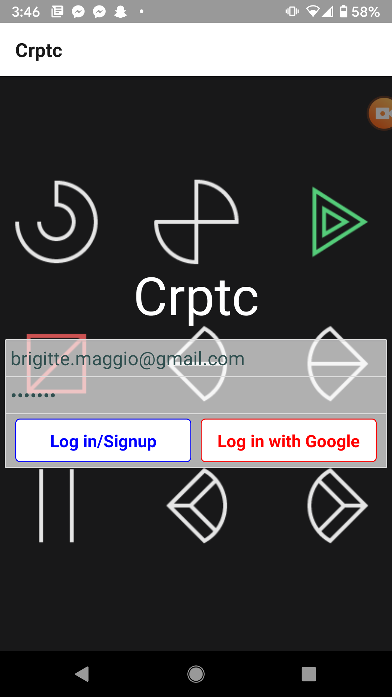
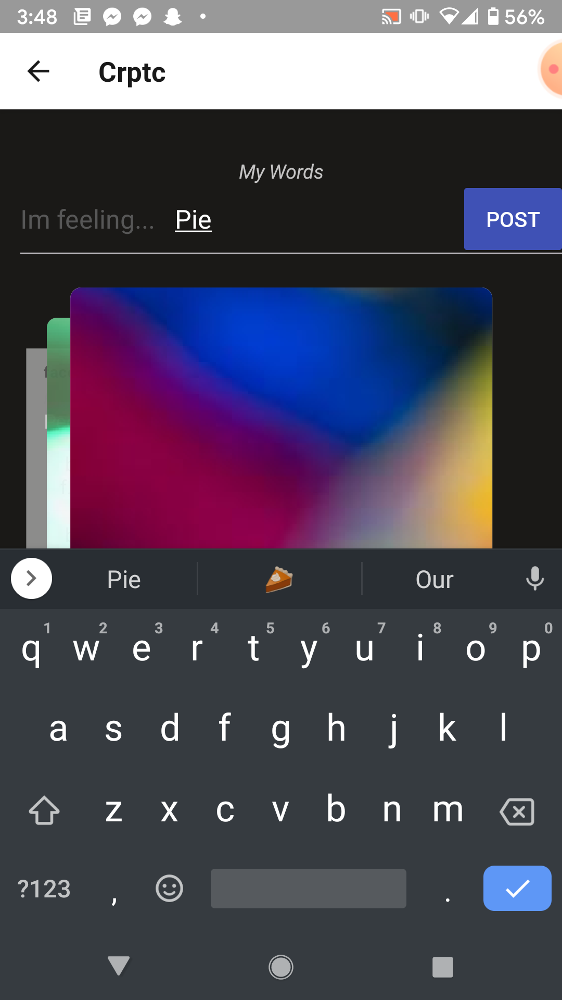
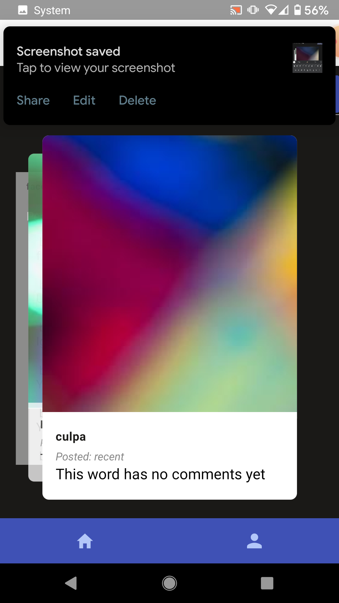
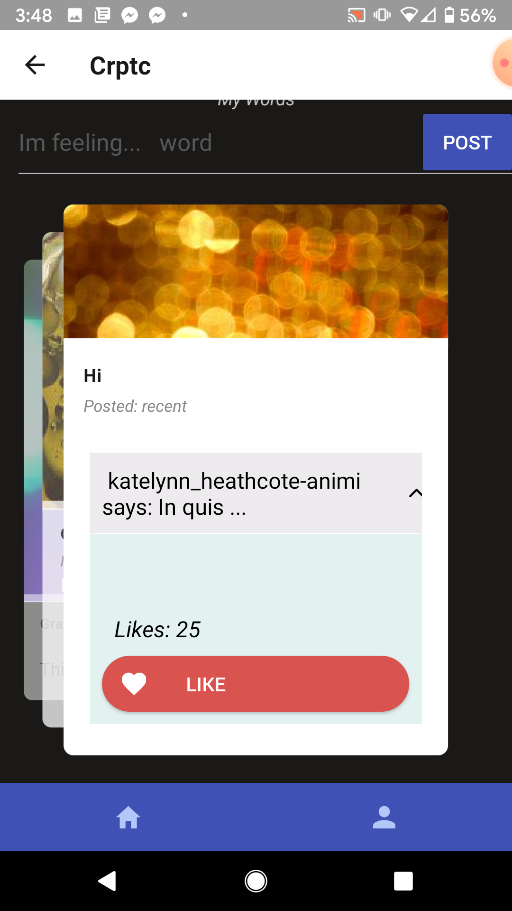

# Crptc

Crptc is a social media mobile application that encourages humor and creativity. Users’ posts can only be one word (real or made up) to express what they’re feeling. Other users comment on the word with a description of what they think the post meant. Descriptions with the most likes are presented at the top. The posts can be real words or made-up words. The only rule is that it can only be a single word! On the frontend, I used React Native, Expo, Native Base, and Hooks. My data was stored and managed with Firestore.

# Screenshots

the screenshots below take you through the basic user flow of Crptc.  User logs in, adds a word, scrolls through friends' words, adds comments and likes.  Repeat!

   

